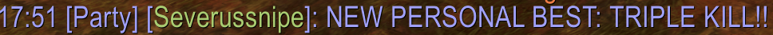
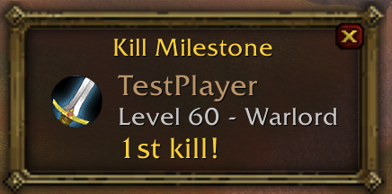
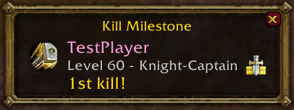
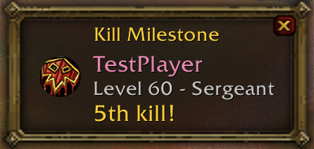
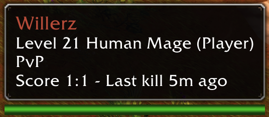
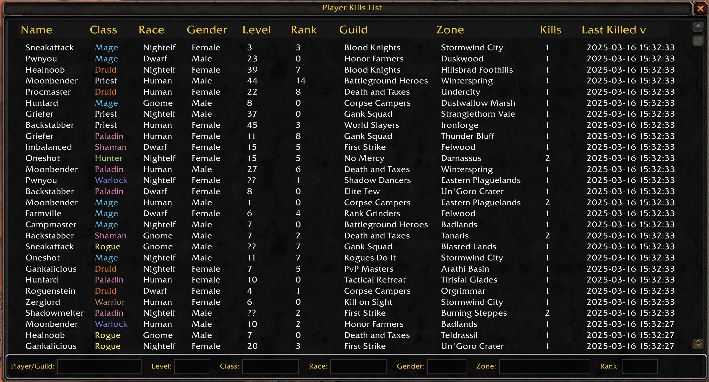
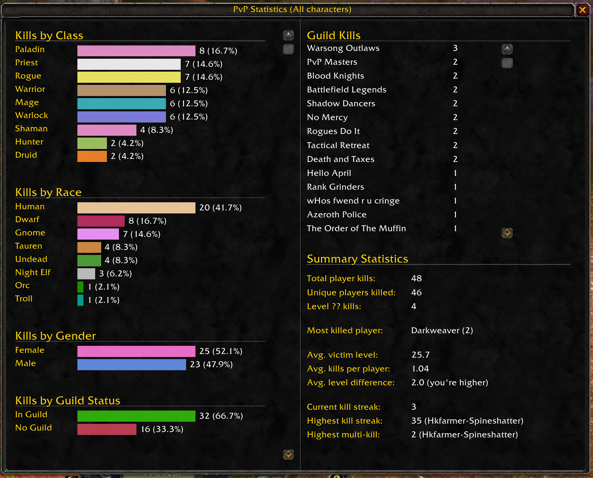
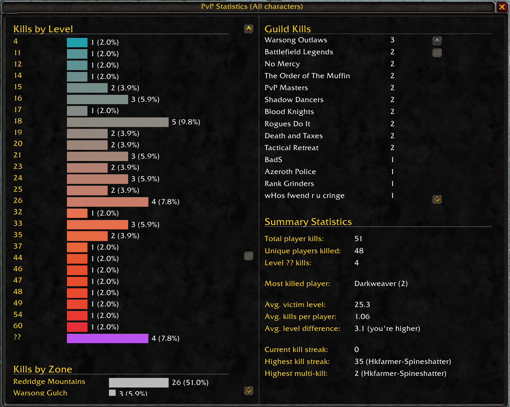
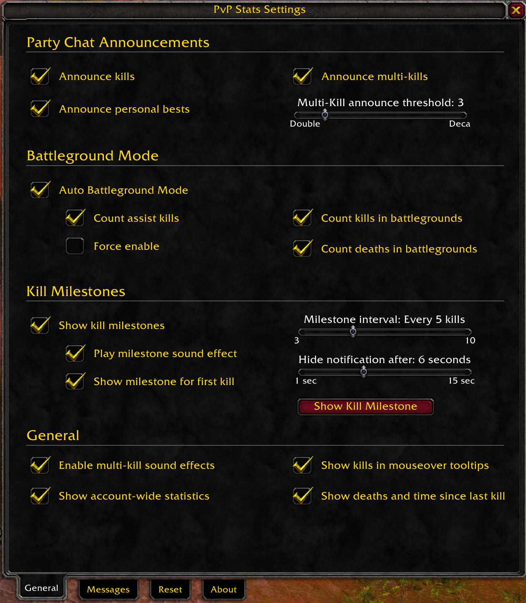
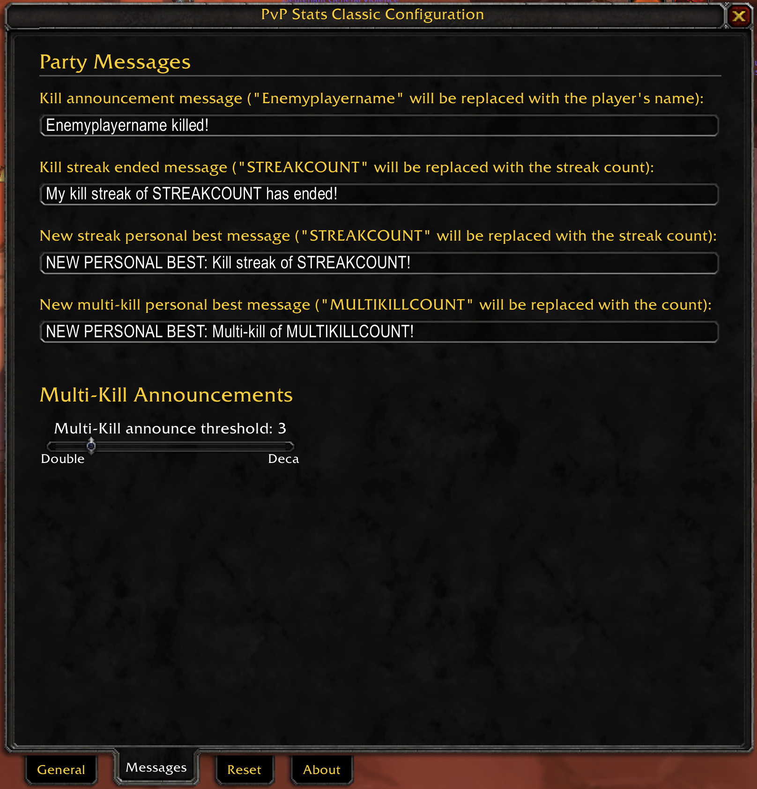

# PvP Stats (Classic)
PvP Stats tracks your PvP history and provides detailed statistics and customizable notifications. Whether you're ganking in the open world or dominating BGs, this addon greatly enhances your PvP experience!

### Key Features:
- **Kill Tracking**: Details of enemy players kills are stored: name, level, class, race, guild and PvP rank
- **Kill Statistics**: View your most killed classes, races, zones, and individual players
- **Kills List**: See all your kills at a glance and filter them by player name, class, race, level, PvP rank or zone
- **Death and Assists Tracking**: See who killed you when, where and who assisted
- **Party Chat Announcements**: Customizable messages for announcing kills, kill streaks and achievements
- **Kill Streaks & Multi-Kills**: Visual and acoustic notifications for kill streaks and multi-kills
- **Kill Milestones**: Notifications when you kill players for the 1st, 5th, 10th, ... time
- **Mouseover Tooltip**: Quickly see how often you killed players when hovering your mouse over them
- **Battleground Mode**: Party chat announcements are automatically disabled when you join a BG to prevent spam
- **Fully Customizable**: Set custom announcement messages, kill streak/milestone notification thresholds and disable/enable any feature as you like it
- **And much more...**

## Screenshots
### Customizable Party announce messages:
Kills, Kill streaks and Multi-kills:

### Kill milestones:

### Customizable Mouseover tooltips:

### Kills List:

### Statistics:

### Configuration / Customization:

