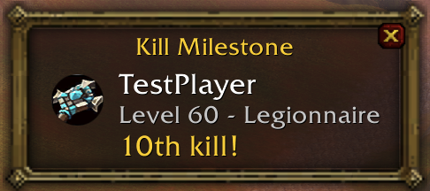

# !!! Version 0.9 Release Candiate. Only for testing purposes !!!
This is a release candiate version meaning it has been tested and should be mostly bug-free. It can still have bugs, though! Please report them to Severussnipe or Hkfarmer \<Redridge Police\>.

# PvP Stats Classic
PvP Stats Classic tracks your PvP kills and provides detailed statistics and customizable notifications. Whether you're ganking in the open world or dominating BGs, this addon greatly enhances your PvP experience!

### Key Features:
- **Kill Tracking**: Details of enemy players kills are stored: name, level, class, race, guild and PvP rank
- **Kill Statistics**: View your most killed classes, races, zones, and individual players
- **Kills List**: See all your kills at a glance and filter them by player name, class, race, level, PvP rank or zone
- **Party Chat Announcements**: Customizable messages for announcing kills, kill streaks and achievements
- **Kill Streaks & Multi-Kills**: Visual and acoustic notifications for kill streaks and multi-kills
- **Kill Milestones**: Notifications when you kill players for the 1st, 5th, 10th, ... time
- **Mouseover Tooltip**: Quickly see how often you killed players when hovering your mouse over them
- **Battleground Mode**: Party chat announcements are automatically disabled when you join a BG to prevent spam
- **Fully Customizable**: Set custom announcement messages and kill streak/milestone notification thresholds
- **And much more...**

## Screenshots
### Customizable Party announce messages:
Kills:

Kill streaks / multi-kills:

### Kill milestones:

### Mouseover tooltips:

### Kills List:

### Statistics:

### Configuration / Customization:

